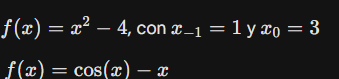

1. División por Cero en Métodos de Búsqueda de Raíces
Este error se da en métodos abiertos como Newton-Raphson. Ocurre cuando la derivada de la función se vuelve cero (o muy cercana a cero), provocando una división por cero en la fórmula iterativa.

2. Error de Truncamiento en Ecuaciones Diferenciales: Se ilustra con el método de Euler. Si el tamaño del paso ($h$) al discretizar un proceso continuo es demasiado grande, el error se acumula iteración tras iteración, alejando la simulación del resultado real matemático. 

3. Subdesbordamiento Aritmético (Underflow)
Este error sucede cuando una operación genera un número tan minúsculo que la computadora no puede representarlo y lo redondea a 0.0. Si ese valor luego se usa como divisor, causará una falla en el programa.

4. Falla de la Propiedad Asociativa en Coma Flotante
Demuestra que en programación, el orden en que se suman números de punto flotante de diferentes magnitudes altera el resultado. Sumar de una forma u otra provoca pérdidas de precisión.README.md